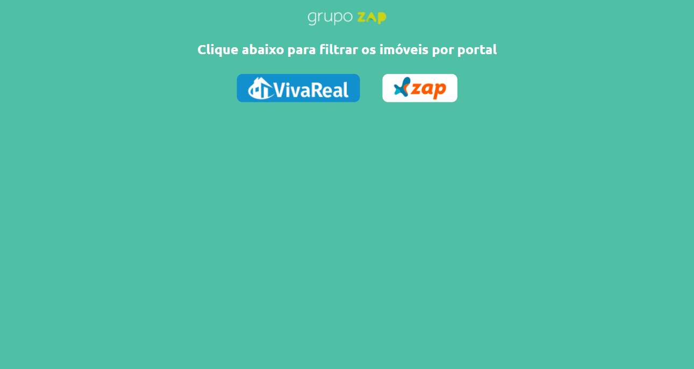
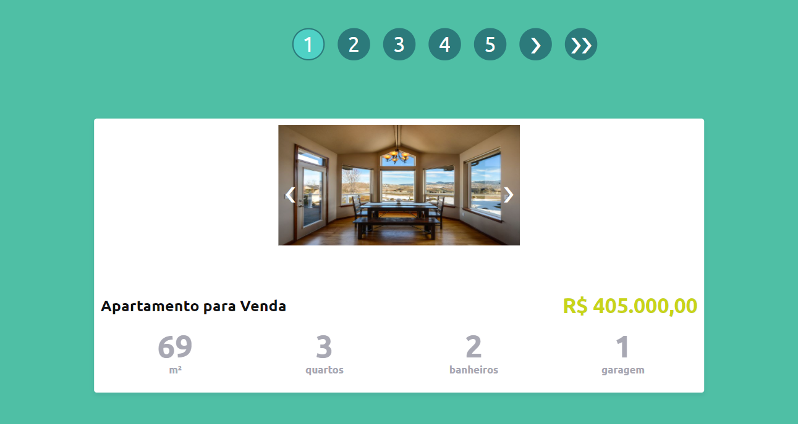
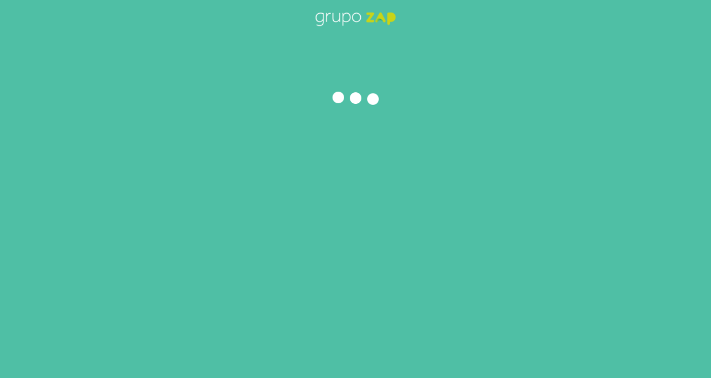

<p align="center">
  <a href="https://angular.io/">
    
  </a>
</p>
<h2 align="center">
  Desafio olxbr para vaga front-end em Angular - Javascript
</h2>

## eng-zap-challenge-javascript

Projeto gerado com o [Angular CLI](https://github.com/angular/angular-cli) versão 10.0.1.

## 🚀 Angular - Frontend

1.  **Instale as dependências**

    ```shell
    cd eng-zap-challenge-javascript/
    npm install
    ```

2.  **Start o projeto**

    ```shell
    ng serve
    ou
    npm run start
    ```
    Navegue para o endereço: `http://localhost:4200/`

3.  **Build**

    ```shell
    ng build
    ```
    O pacote estará no diretório `dist/`.

## 🌐 Link

[Desafio Olx](https://olxbr.github.io/cultura/challenges/frontend.html)
[Base de Dados - data.json](http://grupozap-code-challenge.s3-website-us-east-1.amazonaws.com/sources/source-1.json)

## 💻 Layout

### /home

### /products/:PORTAL?page=1

### /products/:PORTAL/:ID

### /page-not-found

### loading

